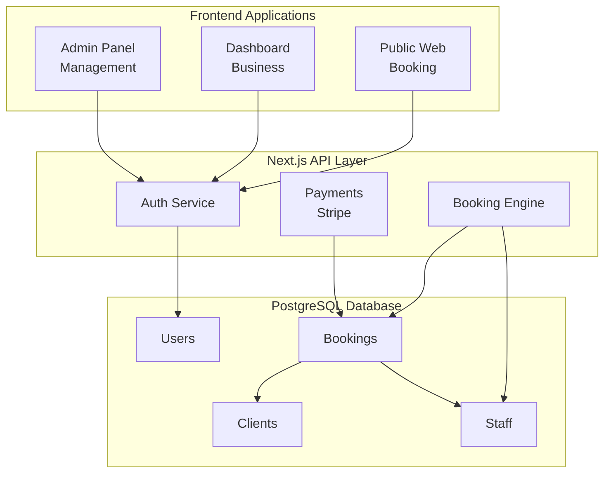

# Lumina

> **Intelligent Software for Small Business Growth**

[](https://github.com/jshields-ca/lumina/actions/workflows/ci.yml)
[](https://github.com/jshields-ca/lumina/actions/workflows/deploy.yml)
[](https://uselumina.app)
[](https://lumina-staging.railway.app)
[](https://www.typescriptlang.org/)
[](https://nextjs.org/)
[](https://www.postgresql.org/)
[](https://www.prisma.io/)
[](https://tailwindcss.com/)
[](LICENSE)
[](https://linear.app/scootr-ca/project/useluminaapp-d006c1d51186)

Lumina is a Vertical SaaS (V-SaaS) platform designed specifically for the workflows of modern salons and barbershops. It is a single, elegant solution that consolidates booking, client management, and financials. Its proprietary AI engine sheds light on hidden opportunities and risks, making complex data simple and useful.

> **🚧 Currently in Development** - Foundation phase complete with authentication system and database architecture implemented. Ready for UI development and core feature implementation.

## 🌟 Vision

**Stop managing your business and start building your passion.** Lumina handles the administrative burdens so you can focus on your craft and your clients.

## 🚧 Current Status

**Foundation Phase Complete** - Core infrastructure and authentication system implemented.

### ✅ Implemented Features

- **Project Foundation** - Next.js 14, TypeScript, Docker containerization
- **Database Architecture** - PostgreSQL with comprehensive Prisma schema
- **Authentication System** - NextAuth.js v5 with multi-tenant support
- **UI Design System** - Tailwind CSS component library with Lumina branding
- **CI/CD Pipeline** - GitHub Actions with Railway deployment
- **Testing Framework** - Jest, React Testing Library, Playwright setup
- **User Management** - Role-based access control (Owner, Manager, Staff)
- **Multi-Tenancy** - Business-scoped data access and permissions

### ✅ Recently Completed

- **Complete Business Management Epic (LUM-41)** - All core business management features implemented and operational
- **Business Onboarding System (LUM-47)** - Complete 5-step wizard with financial model configuration, website URL validation, and country-specific address forms
- **Service Management CRUD System (LUM-48)** - Full service creation, editing, listing with search/filter capabilities and business scoping
- **Client Data Import System (LUM-54)** - CSV upload with drag-and-drop, data mapping, validation, and import preview functionality
- **Database Relations Fix** - Resolved critical Prisma relation name mismatch enabling proper business dashboard access
- **End-to-End Authentication Flow** - Full signup → onboarding → dashboard workflow with proper routing and middleware
- **Hybrid Employment Model** - Database architecture and financial calculation engine for commission, chair rental, and hybrid staff arrangements
- **Development Environment** - Optimized TypeScript config and VS Code setup
- **Workflow Integration** - Complete Agent Hook system for documentation sync, steering compliance, and Linear integration
- **Documentation Audit** - Comprehensive documentation review and steering system integration
- **Production Infrastructure** - Zero-downtime deployment scripts and monitoring systems
- **Build Stability** - TypeScript syntax error resolution and enhanced coding standards

### 🚧 Next Up

- **Booking Engine Core Functionality** - Staff availability management and time slot calculation engine
- **Service Management** - CRUD operations for salon services and pricing (foundation complete)
- **Client Data Import** - CSV import system for existing client databases (foundation complete)
- **Hybrid Employment UI** - User interface components for managing mixed employment types

### 📋 Planned Features

#### 🎯 Core MVP Features

- **Smart Booking System** - Public booking interface with real-time availability
- **Client Management** - Comprehensive CRM with appointment history and preferences
- **Staff Management** - Hybrid employment model support with commission, chair rental, and mixed arrangements
- **Point of Sale** - Integrated POS with payment processing and receipt generation
- **Financial Reporting** - Revenue analytics with employment type breakdowns, commission calculations, and tax reporting
- **Business Dashboard** - Real-time insights and performance metrics

#### 🚀 Post-MVP Features

- **AI-Powered Insights** - Predictive analytics and revenue optimization suggestions
- **QuickBooks Integration** - Seamless accounting software synchronization
- **Square POS Integration** - External POS system data synchronization
- **Mobile Applications** - Native mobile apps for staff and clients

## 🛠 Tech Stack

- **Framework**: Next.js 14 with App Router
- **Language**: TypeScript with strict mode
- **Database**: PostgreSQL 15+ with Prisma ORM
- **Authentication**: NextAuth.js v5 (Auth.js) with multi-tenant support
- **Payments**: Stripe Connect (planned)
- **Styling**: Tailwind CSS with Lumina design system
- **Containerization**: Docker with multi-stage builds
- **Deployment**: Railway with preview deployments
- **CI/CD**: GitHub Actions (planned)
- **Testing**: Jest, React Testing Library, Playwright
- **Monitoring**: Sentry (planned)
- **Development**: Husky pre-commit hooks, ESLint, Prettier

## 🏗 Architecture



## 🚀 Getting Started

### Prerequisites

- [Docker](https://docs.docker.com/get-docker/) and Docker Compose (recommended)
- OR Node.js 18+ and PostgreSQL 14+ (for local development)

### Quick Start with Docker (Recommended)

1. **Clone the repository**

   ```bash
   git clone https://github.com/jshields-ca/lumina.git
   cd lumina
   ```

2. **Start the development environment**

   ```bash
   npm run docker:dev
   ```

3. **Initialize the database**

   ```bash
   npx prisma migrate dev --name init
   npx prisma db seed
   ```

4. **Access the application**
   - Application: [http://localhost:3000](http://localhost:3000)
   - Authentication: [http://localhost:3000/auth/signin](http://localhost:3000/auth/signin)
   - Prisma Studio: [http://localhost:5555](http://localhost:5555)
   - Health Check: [http://localhost:3000/api/health](http://localhost:3000/api/health)

### 🎭 Demo Accounts

After seeding the database, you can use these demo accounts:

```yaml
Business Owner:
  Email: owner@lumina-demo.com
  Password: demo123

Senior Hair Stylist:
  Email: mike@lumina-demo.com
  Password: demo123

Nail Technician & Colorist:
  Email: emma@lumina-demo.com
  Password: demo123
```

**Demo Business**: Lumina Demo Salon with pre-configured services, clients, and appointments.

### Local Development (without Docker)

1. **Clone the repository**

   ```bash
   git clone https://github.com/jshields-ca/lumina.git
   cd lumina
   ```

2. **Install dependencies**

   ```bash
   npm install
   ```

3. **Set up environment variables**

   ```bash
   cp .env.example .env.local
   # Edit .env.local with your configuration
   ```

4. **Set up the database**

   ```bash
   npx prisma migrate dev --name init
   npx prisma db seed
   ```

5. **Start the development server**

   ```bash
   npm run dev
   ```

6. **Open your browser**
   Navigate to [http://localhost:3000](http://localhost:3000)

7. **Sign in with demo accounts**
   Use the demo accounts listed above to explore the application

📖 **For detailed setup instructions, see [Development Setup Guide](docs/DEVELOPMENT_SETUP.md)**

## 📚 Documentation

**[📋 Complete Documentation Hub](docs/README.md)** - Navigate all project documentation

### Quick Links

- **[Development Setup](docs/DEVELOPMENT_SETUP.md)** - Get started with local development
- **[Git Workflow](docs/GIT_WORKFLOW.md)** - Branching and development process
- **[Testing Guide](docs/TESTING.md)** - Testing framework and best practices
- **[Authentication System](docs/AUTHENTICATION.md)** - Multi-tenant auth system
- **[Brand Guidelines](docs/LUMINA_PRODUCT_STYLEGUIDE.md)** - Design system and UI
- **[Changelog](CHANGELOG.md)** - Version history and release notes

### 🎯 AI-Powered Development Guidance

Lumina includes a comprehensive **Steering System** that provides context-aware development guidance:

- **Automatic Application**: Coding standards and security guidelines are automatically applied based on file types
- **Specialized Guidance**: API, database, UI, and security standards are applied to relevant files
- **Consistent Patterns**: Ensures all developers follow the same multi-tenant SaaS best practices
- **Security First**: Built-in security guidelines for authentication, data protection, and PCI compliance

**[📖 Steering System Overview](.kiro/steering/README.md)** - Learn how automated guidance works

## 🏃‍♂️ Development

### Available Scripts

```bash
# Development
npm run dev              # Start development server
npm run build            # Build for production
npm run start            # Start production server

# Code Quality
npm run lint             # Run ESLint
npm run lint:fix         # Fix ESLint issues
npm run type-check       # Run TypeScript checks
npm run format           # Format code with Prettier

# Testing
npm run test             # Run unit tests
npm run test:watch       # Run tests in watch mode
npm run test:coverage    # Generate coverage report
npm run test:e2e         # Run end-to-end tests

# Database
npm run db:generate      # Generate Prisma client
npm run db:migrate       # Run database migrations
npm run db:seed          # Seed database with demo data
npm run db:studio        # Open Prisma Studio
npm run db:reset         # Reset database

# Docker
npm run docker:dev       # Start development environment
npm run docker:down      # Stop Docker containers
npm run docker:clean     # Clean Docker volumes
```

### Project Structure

```
lumina/
├── app/                    # Next.js App Router
│   ├── api/               # API routes
│   │   ├── auth/          # Authentication endpoints
│   │   └── health/        # Health check endpoint
│   ├── auth/              # Authentication pages
│   │   ├── signin/        # Sign-in page
│   │   └── signup/        # Registration page
│   └── page.tsx           # Landing page
├── components/            # Reusable UI components
│   ├── auth/              # Authentication components
│   └── ui/                # Base UI components (shadcn/ui)
├── lib/                   # Utility functions and configurations
│   ├── auth.ts            # Authentication utilities
│   ├── auth-config.ts     # NextAuth.js configuration
│   ├── prisma.ts          # Database connection
│   ├── db-utils.ts        # Database helper functions
│   └── utils.ts           # General utilities
├── prisma/                # Database schema and migrations
│   ├── schema.prisma      # Database schema
│   └── seed.ts            # Demo data seeding
├── types/                 # TypeScript type definitions
│   ├── auth.ts            # Authentication types
│   └── database.ts        # Database types
├── docs/                  # Documentation
├── .kiro/                 # Kiro IDE configuration
├── docker-compose.yml     # Development environment
├── Dockerfile             # Multi-stage Docker build
└── middleware.ts          # Route protection middleware
```

## 🧪 Testing

We maintain high code quality with comprehensive testing:

- **Unit Tests**: Jest + React Testing Library
- **Integration Tests**: API and database testing
- **End-to-End Tests**: Playwright with cross-browser support
- **Coverage Target**: 80%+ code coverage

```bash
npm run test              # Run all tests
npm run test:watch        # Run tests in watch mode
npm run test:coverage     # Generate coverage report
```

## 🚀 Deployment

### Environments

- **Development**: Local development environment
- **Staging**: `lumina-staging.up.railway.app` (main branch)
- **Production**: `uselumina.app` (production branch)

### Deployment Process

1. **Feature Development**: Create feature branch from `main`
2. **Pull Request**: Open PR to merge into `main`
3. **Staging**: Automatic deployment to staging on merge
4. **Production**: Manual promotion from `main` to `production` branch

## 📊 Project Management

We use Linear for project tracking with a comprehensive label system:

- **Type**: Epic, Feature, Task, Bug, Integration
- **Impact**: Critical, High, Medium, Low
- **Module**: Auth, Booking, CRM, Financials, Dashboard, Infrastructure
- **Size**: XS, S, M, L, XL
- **Stage**: Ready, Blocked, Review, Testing
- **Area**: Foundation, Business, Scheduling, Client Management, Payments, Analytics, QA, Production

## 🎨 Brand Guidelines

Lumina follows a comprehensive brand system:

- **Primary Colors**: Lumina Radiant Gradient (#FFD25A to #FF7A5A)
- **Secondary Colors**: Deep Teal (#0B2B33)
- **Typography**: Inter (primary), IBM Plex Mono (accent)
- **Design Principles**: Clarity, Empowerment, Innovation, Accessibility

## 🤝 Contributing

We use a **Feature Branch Workflow** for all development. Please follow our [Git Workflow](docs/GIT_WORKFLOW.md) for detailed instructions.

### Quick Start

1. **Create a feature branch**: `git checkout -b feat/your-feature-name`
2. **Make your changes** and add tests
3. **Commit with conventional messages**: `git commit -m 'feat: add amazing feature'`
4. **Push to your branch**: `git push origin feat/your-feature-name`
5. **Open a Pull Request** with description and testing notes

### Development Standards

- **Branching**: Feature branch workflow with descriptive names
- **Code Style**: ESLint + Prettier with pre-commit hooks
- **Commits**: [Conventional Commits](https://conventionalcommits.org/) specification
- **Testing**: All new features must include tests (80%+ coverage target)
- **Documentation**: Update relevant documentation and changelog
- **Reviews**: All changes require code review before merging

📖 **See [Git Workflow Guide](docs/GIT_WORKFLOW.md) for complete development process**

### See Also

- **[Steering System](/.kiro/steering/README.md)** - Automated development guidance
- **[Security Guidelines](/.kiro/steering/security.md)** - Multi-tenant security standards
- **[API Standards](/.kiro/steering/api-standards.md)** - RESTful API design patterns

## 📝 License

This project is proprietary software. All rights reserved.

## 🙋‍♂️ Support

For questions or support, please contact:

- **Email**: [Your Email]
- **Linear**: [Project Link]
- **GitHub Issues**: For bug reports and feature requests

---

**Built with ❤️ by Effuse Labs**

_Democratizing the power of technology for small businesses_
