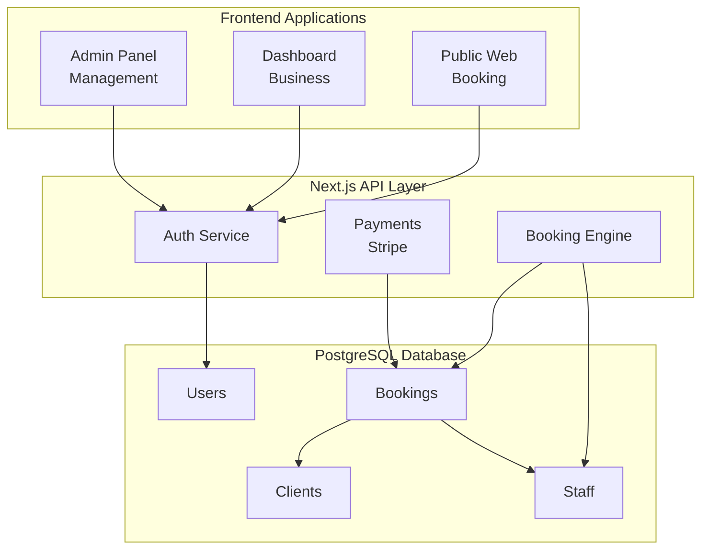

# Lumina

> **Intelligent Software for Small Business Growth**

[](https://www.typescriptlang.org/)
[](https://nextjs.org/)
[](https://www.postgresql.org/)
[](https://www.prisma.io/)
[](https://tailwindcss.com/)
[](LICENSE)
[](https://linear.app/scootr-ca/project/useluminaapp-d006c1d51186)

Lumina is a Vertical SaaS (V-SaaS) platform designed specifically for salons and barbershops. It consolidates booking, client management, and financials into a single, elegant solution with AI-powered insights that transform complex business data into actionable intelligence.

## 🌟 Vision & Purpose

**"Stop managing your business and start building your passion."**

Lumina empowers salon and barbershop owners to focus on their craft and clients by eliminating administrative burdens. Our platform transforms complex business operations into intuitive workflows, providing AI-powered insights that reveal hidden opportunities and optimize business performance.

### Why Lumina?

- **Industry-Specific**: Built exclusively for salon and barbershop workflows
- **All-in-One Solution**: Eliminates the need for multiple disconnected tools
- **AI-Powered Intelligence**: Transforms data into actionable business insights
- **Scalable Growth**: Supports businesses from single-chair operations to multi-location enterprises

## 🎯 Core Features

### MVP Features (86% Complete)

- **📊 Professional Dashboard** - Real-time analytics with interactive charts and business intelligence
- **👥 Multi-Tenant Business Management** - Complete business operations with role-based access control
- **🔐 Enterprise Authentication** - NextAuth.js v5 with business-scoped data isolation and RBAC
- **💰 Financial Management** - Revenue tracking, commission calculations, and payment processing
- **👤 Client Management (CRM)** - Complete client lifecycle with appointment history and preferences
- **⚙️ Service Management** - CRUD operations with advanced search, filtering, and status management

### In Development

- **📅 Smart Scheduling System** - Advanced appointment booking with staff and service management (LUM-92)
- **🔌 Payment Integration** - Stripe payment processing with PCI compliance (LUM-83)
- **🔑 OAuth Integration** - Google OAuth for enhanced authentication (LUM-79)

### Post-MVP Roadmap

- **📦 Inventory Management** - Product tracking, stock management, and sales analytics (LUM-105)
- **🤖 AI-Powered Insights** - Intelligent business recommendations and predictive analytics (LUM-88)
- **🔗 Advanced Integrations** - Square POS, enhanced data import, and third-party connectors (LUM-86, LUM-87)

## 🎨 Brand Guidelines

Lumina follows a comprehensive brand system that reflects our Creator archetype:

- **Primary Colors**: Lumina Radiant Gradient (#FFD25A to #FF7A5A)
- **Secondary Colors**: Deep Teal (#0B2B33)
- **Typography**: Inter (primary), IBM Plex Mono (accent)
- **Design Principles**: Clarity, Empowerment, Innovation, Accessibility

**[📖 Complete Brand Guidelines](docs/design-system/lumina-product-styleguide.md)** | **[🎨 Design System Demo](/design-system)**

## 🤖 AI-Assisted Development

Lumina leverages AI-powered development tools for enhanced productivity and code quality:

### Steering System

Comprehensive **Steering System** that provides context-aware development guidance:

- **Automatic Application**: Coding standards and security guidelines are automatically applied based on file types
- **Specialized Guidance**: API, database, UI, and security standards are applied to relevant files
- **Consistent Patterns**: Ensures all developers follow the same multi-tenant SaaS best practices
- **Security First**: Built-in security guidelines for authentication, data protection, and PCI compliance

**[📖 Steering System Overview](.kiro/steering/README.md)** - Learn how automated guidance works

### Development Guidelines

- **[💻 Coding Standards](.kiro/steering/coding-approach-and-standards.md)** - TypeScript, React, and architecture patterns
- **[🔌 API Standards](.kiro/steering/api-standards.md)** - RESTful API design and implementation
- **[🗄️ Database Standards](.kiro/steering/database-standards.md)** - Multi-tenant data patterns and Prisma conventions
- **[🎨 UI Standards](.kiro/steering/ui-standards.md)** - Component design and accessibility guidelines
- **[🔒 Security Standards](.kiro/steering/security.md)** - Authentication, authorization, and data protection

## 🛠 Tech Stack

### Core Technologies

- **Framework**: Next.js 14 with App Router and React Server Components
- **Language**: TypeScript with strict mode and comprehensive type safety
- **Database**: PostgreSQL 15+ with Prisma ORM and multi-tenant architecture
- **Authentication**: NextAuth.js v5 (Auth.js) with business-scoped sessions
- **Styling**: Tailwind CSS with custom Lumina design system
- **UI Components**: Radix UI primitives with shadcn/ui integration

### Development & Deployment

- **Containerization**: Docker with multi-stage builds for development and production
- **Deployment**: Railway platform with automatic deployments
- **Testing**: Jest, React Testing Library, and Playwright for comprehensive coverage
- **Code Quality**: ESLint, Prettier, and Husky pre-commit hooks
- **Development Tools**: TypeScript strict mode, comprehensive linting, and automated formatting

### Integrations & Services

- **Payments**: Stripe API with PCI-compliant payment processing (in development)
- **Email**: Resend API for transactional emails and notifications
- **Monitoring**: Sentry integration for error tracking and performance monitoring
- **Analytics**: Custom analytics dashboard with Recharts visualization

## 🏗 Architecture



## 📚 Documentation

**[📋 Complete Documentation Hub](docs/README.md)** - Navigate all project documentation

### Quick Links

- **[Development Setup](docs/development-setup.md)** - Get started with local development
- **[Testing Guide](docs/testing/README.md)** - Testing framework and best practices
- **[Authentication System](docs/features/authentication/README.md)** - Multi-tenant auth system
- **[API Documentation](docs/api/README.md)** - RESTful API endpoints and integration
- **[Feature Documentation](docs/features/README.md)** - Complete feature implementation guides
- **[Project Management](docs/project-management/README.md)** - Development workflow and Linear integration
- **[Changelog](CHANGELOG.md)** - Version history and release notes

### 🔧 Project Management & Specifications

- **[📋 Active Specifications](.kiro/specs/)** - Current feature specifications and development plans
- **[✅ Completed Specifications](.kiro/specs/completed-or-archived/)** - Finished feature implementations and archived specs
- **[🎯 Linear Best Practices](.kiro/steering/linear-best-practices.md)** - Issue management and labeling guidelines
- **[📊 Project Management Hub](docs/project-management/README.md)** - Workflow documentation and Linear integration

#### Linear Integration

Lumina includes seamless Linear integration for project tracking:

- **🚧 Auto-create Linear issues** for high-priority blockers
- **📝 Link decisions to Linear issues** for architectural context
- **🔄 Bi-directional sync** between daily status and Linear
- **📊 Integrated reporting** with Linear issue tracking

**[📖 Linear Integration Guide](docs/project-management/linear-integration-guide.md)** - Complete setup and usage

## 🏃‍♂️ Development

### Available Scripts

> ⚠️ **Critical Warning**: Documentation audit scripts in `/scripts/` have critical safety issues - **DO NOT USE**. See [LUM-78](https://linear.app/scootr-ca/issue/LUM-78) for fix tracking.

#### Development Commands

```bash
npm run dev              # Start development server (does not modify code)
npm run build            # Build for production (does not modify code)
npm run start            # Start production server (does not modify code)
```

#### Code Quality Commands ⚠️ _Modifies Code_

```bash
npm run lint             # Run ESLint (read-only analysis)
npm run lint:fix         # Fix ESLint issues (MODIFIES CODE)
npm run type-check       # Run TypeScript checks (read-only analysis)
npm run format           # Format code with Prettier (MODIFIES CODE)
```

#### Testing Commands

```bash
npm run test             # Run unit tests (does not modify code)
npm run test:watch       # Run tests in watch mode (does not modify code)
npm run test:coverage    # Generate coverage report (does not modify code)
npm run test:e2e         # Run end-to-end tests (does not modify code)
npm run test:all         # Run all tests (does not modify code)
```

#### Database Commands ⚠️ _Modifies Database_

```bash
npm run db:generate      # Generate Prisma client (MODIFIES generated files)
npm run db:migrate       # Run database migrations (MODIFIES DATABASE)
npm run db:seed          # Seed database with demo data (MODIFIES DATABASE)
npm run db:studio        # Open Prisma Studio (read-only interface)
npm run db:reset         # Reset database (DESTROYS ALL DATA)
```

#### Docker Commands

```bash
npm run docker:dev       # Start development environment (does not modify code)
npm run docker:down      # Stop Docker containers (does not modify code)
npm run docker:clean     # Clean Docker volumes (removes Docker data)
```

#### Project Management Commands

```bash
npm run daily-status:init          # Initialize daily status file (creates new file)
npm run daily-status:add-decision  # Add structured decision (MODIFIES documentation)
npm run daily-status:add-blocker   # Add blocker tracking (MODIFIES documentation)
npm run daily-status:report        # Generate status report (does not modify files)
npm run daily-status:weekly        # Generate weekly summary (does not modify files)
```

### Project Structure

```
lumina/
├── app/                    # Next.js App Router
│   ├── api/               # API routes
│   │   ├── auth/          # Authentication endpoints
│   │   ├── clients/       # Client management API
│   │   ├── booking/       # Booking system API
│   │   ├── services/      # Service management API
│   │   ├── staff/         # Staff management API
│   │   ├── payments/      # Payment processing API
│   │   ├── transactions/  # Transaction management API
│   │   ├── reports/       # Financial reporting API
│   │   └── health/        # Health check endpoint
│   ├── (dashboard)/       # Protected dashboard pages
│   │   ├── clients/       # Client management pages
│   │   ├── services/      # Service management pages
│   │   ├── onboarding/    # Business onboarding
│   │   └── dashboard/     # Main dashboard
│   ├── auth/              # Authentication pages
│   │   ├── signin/        # Sign-in page
│   │   └── signup/        # Registration page
│   ├── book/              # Public booking interface
│   └── page.tsx           # Landing page
├── components/            # Reusable UI components
│   ├── auth/              # Authentication components
│   ├── clients/           # Client management components
│   ├── booking/           # Booking system components
│   ├── services/          # Service management components
│   ├── staff/             # Staff management components
│   ├── payments/          # Payment processing components
│   └── ui/                # Base UI components (shadcn/ui)
├── lib/                   # Utility functions and configurations
│   ├── auth.ts            # Authentication utilities
│   ├── auth-config.ts     # NextAuth.js configuration
│   ├── prisma.ts          # Database connection
│   ├── db-utils.ts        # Database helper functions
│   ├── stripe.ts          # Stripe payment integration
│   ├── financial/         # Financial calculation utilities
│   ├── email/             # Email system utilities
│   └── utils.ts           # General utilities
├── prisma/                # Database schema and migrations
│   ├── schema.prisma      # Database schema
│   └── seed.ts            # Demo data seeding
├── types/                 # TypeScript type definitions
│   ├── auth.ts            # Authentication types
│   └── database.ts        # Database types
├── docs/                  # Documentation
├── .kiro/                 # Kiro IDE configuration
├── docker-compose.yml     # Development environment
├── Dockerfile             # Multi-stage Docker build
└── middleware.ts          # Route protection middleware
```

## 🧪 Testing

We maintain high code quality with comprehensive testing:

- **Unit Tests**: Jest + React Testing Library
- **Integration Tests**: API and database testing
- **End-to-End Tests**: Playwright with cross-browser support
- **Coverage Target**: 80%+ code coverage

```bash
npm run test              # Run all tests
npm run test:watch        # Run tests in watch mode
npm run test:coverage     # Generate coverage report
```

## 🚀 Deployment

### Environments

- **Development**: Local development environment with Docker Compose
- **Staging**: _Planned_ - Automatic deployment from `main` branch (Railway)
- **Production**: _Planned_ - `uselumina.app` domain (Railway)

### Deployment Process

1. **Feature Development**: Create Linear issue and feature branch from `main`
2. **Development**: Implement feature following Linear issue requirements
3. **Testing**: Ensure all tests pass and code quality checks succeed
4. **Merge to Main**: Direct merge to `main` (no PR required for solo development)
5. **Staging Deployment**: _Future_ - Automatic deployment to staging environment
6. **Production Deployment**: _Future_ - Manual promotion process (to be defined)

### Current Status

- **Railway Integration**: Platform selected for deployment infrastructure
- **Staging Environment**: Not yet configured (planned in LUM-112)
- **Production Environment**: Not yet configured (planned as part of MVP completion)
- **CI/CD Pipeline**: Basic GitHub Actions configured, full pipeline in development

**Note**: Deployment automation and environments will be established as part of the production readiness phase (LUM-112, LUM-113, LUM-115).

## 📊 Project Management

We use Linear for comprehensive project tracking with a systematic approach:

**[📋 Project Management Hub](docs/project-management/README.md)** - Complete workflow documentation

### Linear Integration

Lumina includes seamless Linear integration for project tracking and documentation workflow:

- **Comprehensive Labeling System**: Type, Impact, Module, Size, Stage, and Area labels for precise categorization
- **Epic Organization**: Clear hierarchy with parent-child relationships for complex features
- **Automated Workflows**: Integration with daily status tracking and decision logging
- **Progress Tracking**: Real-time status updates with detailed completion criteria

#### Label System

- **Type**: Epic, Feature, Task, Bug, Integration
- **Impact**: Critical, High, Medium, Low
- **Module**: Auth, Booking, CRM, Financials, Dashboard, Infrastructure
- **Size**: XS, S, M, L, XL
- **Stage**: Ready, Blocked, Review, Testing
- **Area**: Foundation, Business, Scheduling, Client Management, Payments, Analytics, QA, Production

**[📖 Linear Best Practices Guide](.kiro/steering/linear-best-practices.md)** - Complete labeling and workflow standards

### Development Workflow

1. **Linear Issue Creation**: All development work starts with a Linear issue
2. **Branch Creation**: Create feature branch from `main` using Linear issue identifier
3. **Implementation**: Follow issue requirements and acceptance criteria
4. **Testing & Quality**: Ensure comprehensive testing and code quality standards
5. **Documentation**: Update relevant documentation and link to Linear issue
6. **Completion**: Mark Linear issue as complete with implementation summary

**Note**: Currently solo-developed project with direct merges to `main`. Pull request workflow will be implemented for future team collaboration.

## 📝 License

This project is proprietary software. All rights reserved.

---

**Built with ❤️ by Effuse Labs**

_Democratizing the power of technology for small businesses_
